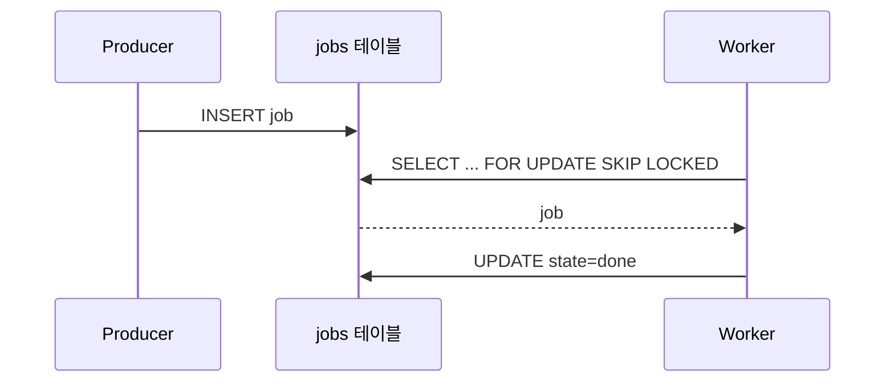

# Research: 작업 큐 라이브러리 두 개 비교

## 질문

배치 작업을 돌릴 큐 라이브러리를 하나 고른다. 이 문서를 인용할 것은 그 결정을 적을 ADR 이다.
읽을 수 있었던 범위는 두 라이브러리의 공개 문서와 각자의 예제 저장소다.

## 기준

### CRIT-001 — 새로 세울 서버가 없다

브로커가 하나 늘면 당직 범위가 늘고, 이 변경의 값이 달라진다.

### CRIT-002 — 초당 1000건을 받는다

지금 야간 배치의 최고치가 초당 800건이다. 이 아래면 지금 것을 바꿀 이유가 없다.

## 출처

### SRC-001 — A 라이브러리 아키텍처 문서

- 위치: https://example.com/a/architecture
- 조회: 2026-09-10

워커가 저장소 테이블을 직접 잠그고 꺼낸다고 적혀 있다. 브로커 프로세스가 없다.



### SRC-002 — A 라이브러리 벤치마크 페이지

- 위치: https://example.com/a/benchmark
- 조회: 2026-09-10

PostgreSQL 14, 워커 4개 기준으로 초당 1200건을 적었다. 측정 명령이 페이지에 함께 실려 있다.

```text
$ a-bench --workers 4 --duration 60s
jobs/sec  1200  p50 3ms  p99 41ms
```

### SRC-003 — B 라이브러리 배포 안내

- 위치: https://example.com/b/deploy
- 조회: 2026-09-10

브로커 한 대를 따로 세워야 하고, 워커는 브로커의 큐를 구독한다고 적혀 있다. 처리량은 같은 조건에서
초당 3400건이다.

```yaml
# 안내 문서의 최소 설정 발췌
broker:
  host: broker.internal
  port: 5672
workers: 4
```

## 선택지

### OPT-001 — A 라이브러리를 쓴다

- 근거: SRC-001, SRC-002

브로커 없이 지금 데이터베이스 위에서 돈다.

### OPT-002 — B 라이브러리를 쓴다

- 근거: SRC-003

브로커를 한 대 세우고 그 위에서 큐를 굴린다.

## 자료

| 잰 것 | OPT-001 A 라이브러리 | OPT-002 B 라이브러리 | 출처 |
|---|---:|---:|---|
| 초당 처리량 (건, 워커 4개) | 1200 | 3400 | SRC-002, SRC-003 |
| p99 지연 (ms) | 41 | 모름 — 안내 문서에 없다 | SRC-002 |

## 비교

| 기준 | OPT-001 A 라이브러리 | OPT-002 B 라이브러리 |
|---|---|---|
| CRIT-001 — 새로 세울 서버가 없다 | 없다 (SRC-001) | 브로커 한 대 (SRC-003) |
| CRIT-002 — 초당 1000건을 받는다 | 1200건 (SRC-002) | 3400건 (SRC-003) |

## 판단

### REC-001 — 지금 규모에서는 A 라이브러리다

- 근거: OPT-001

사실: 두 선택지 모두 CRIT-002 를 넘기고, SRC-001 만 브로커가 없다. 추론: 기준을 둘 다 만족하는 쪽이
하나뿐이다. 가정: 벤치마크의 PostgreSQL 14 조건이 이 저장소의 데이터베이스와 같다는 것은 확인하지
않았다.
